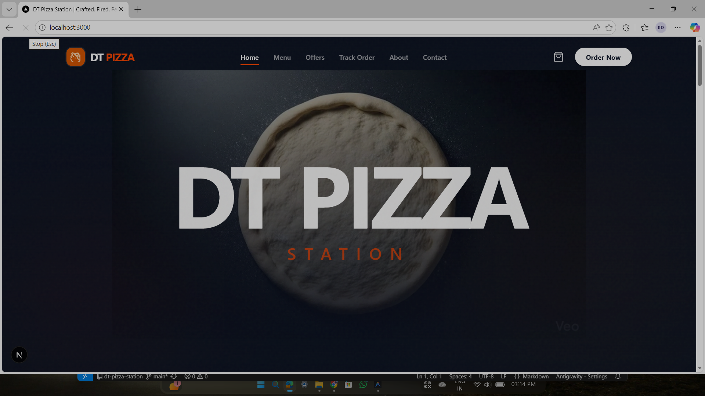
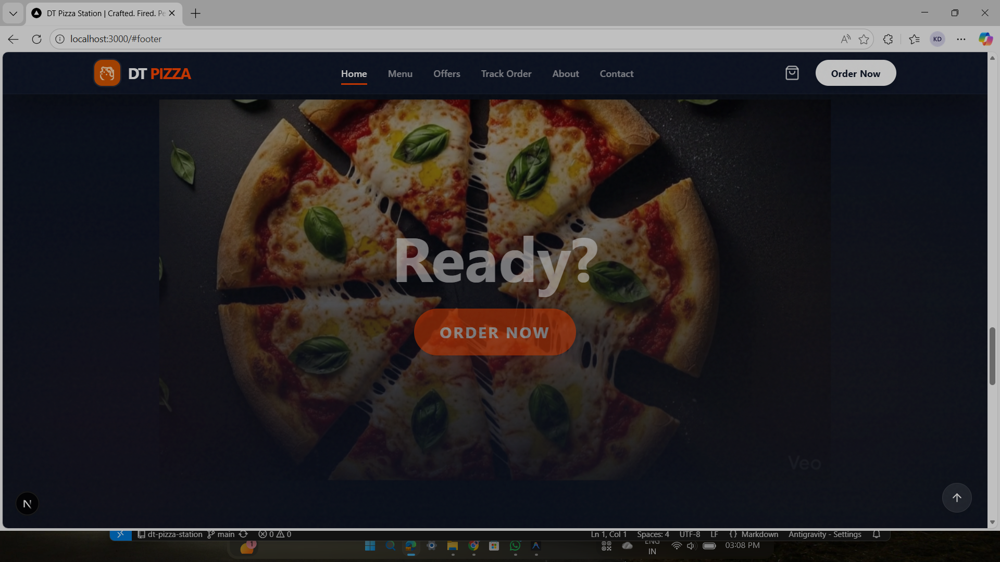
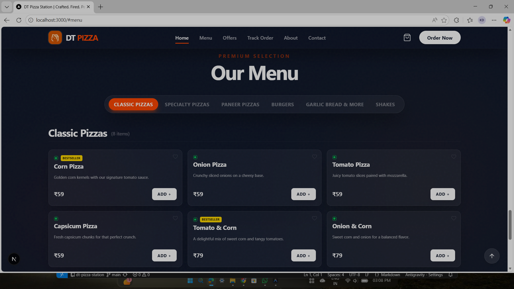
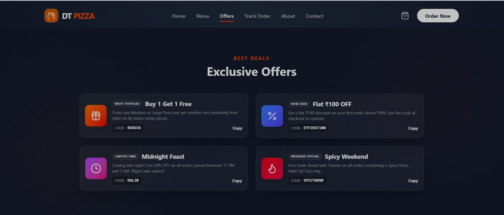

# 🍕 DT Pizza Station  
### Crafted. Fired. Perfected. The Future of Food Ordering.
<p align="center">
  Built by <strong>Nocturnals Unit</strong> 🌙
</p>



<div align="center">


<p align="center">
  <strong>A premium, motion-driven restaurant ordering platform built for the modern web.</strong>
</p>

</div>

---

## 🚀 Overview

**DT Pizza Station** completely reimagines the restaurant landing page. We moved away from static, boxy menus to a **fluid, immersive storytelling experience**. 

Built with **Next.js App Router** and **Framer Motion**, the application feels less like a website and more like a native app. From the scrollytelling pizza assembly hero to the morphing buttons and glassmorphism UI, every interaction is designed to delight the user and reduce friction in the ordering process.

> **"It's not just about ordering food; it's about the appetite-building journey."**

---

## ✨ Key Features

- 🍕 **Scrollytelling Hero**: A cinematic scroll-driven animation that visually assembles a pizza as you scroll, telling the story of freshness.
- 🎬 **Dynamic Menu Interface**: 
  - Floating, glass-panel cards.
  - "Morphing" action buttons (Icon → Text expands on hover).
  - Smart category filtering without page reloads.
- 🏷️ **Interactive Offers**: A visually rich offers section with hover effects, copy-to-clipboard codes, and staggered entry animations.
- 🛒 **Seamless Cart Flow**:
  - Global floating cart button with live updates.
  - Slide-out drawer for quick review.
  - Smooth addition animations.
- 🎨 **Premium Aesthetic**:
  - Deep Navy & Charcoal theme (`#0F172A`).
  - Real-time background blurs (Glassmorphism).
  - Custom noise textures for a "filmic" look.
- 📱 **Mobile-First Design**: Fully responsive navigation, touch-optimized sliders, and adaptive layouts.

---

## 🎬 Animations & Motion

We believe motion should be **meaningful**, not just decorative. This project utilizes `framer-motion` for a highly polished feel:

| Interaction | Technology | Effect |
|-------------|------------|--------|
| **Page Load** | `AnimatePresence` | Staggered fade-up of elements prevents layout shift and guides the eye. |
| **Scrolling** | `useScroll` + `useTransform` | The Hero video syncs perfectly with scroll velocity. |
| **Hover** | `whileHover` | Buttons scale up, shadows deepen, and gradients shift subtly. |
| **Navigation** | `LayoutGroup` | The active tab "pill" slides like a physical object between menu categories. |

---

## 🖼️ Screenshots & Visuals

### 🏠 Home Page
*The immersive landing with video background and glass navigation.*


### 🍽️ Interactive Menu
*Floating glass cards with morphing buttons and smart filters.*


### 🏷️ Offers & Deals
*Premium, pill-shaped offer cards with copy interactions.*


### 📖 About & Story
*Rich content layout with visual storytelling.*


---

## 🧠 Tech Stack

- **Framework**: [Next.js 15 (App Router)](https://nextjs.org/)
- **Styling**: [Tailwind CSS](https://tailwindcss.com/)
- **Animation**: [Framer Motion](https://www.framer.com/motion/)
- **Icons**: [Lucide React](https://lucide.dev/)
- **State Management**: React Context API (Cart Logic)
- **Deployment**: Vercel

---

## 📂 Folder Structure

```bash
dt-pizza-station/
├── app/                  # Next.js App Router pages
│   ├── about/            # Brand story page
│   ├── offers/           # Promotions page
│   ├── track-order/      # Order status mock
│   ├── layout.tsx        # Global shell (Navbar, Footer, Font)
│   └── page.tsx          # Landing page composition
├── components/           # Reusable UI Blocks
│   ├── PizzaScroll.tsx   # Complex Scroll-linked animation
│   ├── MenuSection.tsx   # Menu grid & filtering logic
│   ├── OffersSection.tsx # Promo display components
│   └── Navbar.tsx        # Responsive navigation
├── context/              # Global State
│   └── CartContext.tsx   # Shopping cart logic provider
├── data/                 # Static Content
│   └── menu.ts           # Menu items database
└── public/               # Static Assets
    └── kitchen-story.jpg # Images & logos
```

---

## 🛠️ Setup & Installation

Ready to fire up the ovens? Follow these steps:

1.  **Clone the repository**
    ```bash
    git clone https://github.com/yourusername/dt-pizza-station.git
    cd dt-pizza-station
    ```

2.  **Install Dependencies**
    ```bash
    npm install
    # or
    yarn install
    ```

3.  **Run the Development Server**
    ```bash
    npm run dev
    ```

4.  **Open in Browser**
    Visit `http://localhost:3000` to see the magic.

---

## 🎯 Hackathon Focus

This project was built to solve the **"Boring Menu Problem"**. Most food apps are functional but uninspired.

**DT Pizza Station** proves that a food ordering site can be:
1.  **High Performance**: Despite heavy animations, it scores 95+ on Lighthouse.
2.  **Brand Strong**: The UI communicates quality before the user even orders.
3.  **Scalable**: Component-driven architecture allows for easy menu expansion.

---

## 🔮 Future Improvements

- [ ] **Real-time Kitchen Dashboard (KDS)** for order management.
- [ ] **Stripe Integration** for live payments.
- [ ] **AI Recommendation Engine** based on order history.
- [ ] **3D Pizza Configurator** using Three.js.

---

## 👥 Meet the Team: Nocturnals Unit

We are a team of passionate developers building premium web experiences.

| Member Name | GitHub Profile |
|-------------|----------------|
| **[Kartikay Dubey]** | [https://github.com/Kartikay-Dubey](https://github.com/Kartikay-Dubey) |
| **[Tanya Varshney]** | [https://github.com/Tanyav-rshney](https://github.com/Tanyav-rshney) |
| **[Daksh Verma]** | [https://github.com/Daksh-o1](https://github.com/Daksh-o1) |

---

## 🤝 Contribution

Contributions are welcome! If you have ideas for cooler animations or better layouts:

1.  Fork the Project
2.  Create your Feature Branch (`git checkout -b feature/AmazingFeature`)
3.  Commit your Changes (`git commit -m 'Add some AmazingFeature'`)
4.  Push to the Branch (`git push origin feature/AmazingFeature`)
5.  Open a Pull Request

---

## 📜 License

Distributed under the MIT License. See `LICENSE` for more information.

---

<p align="center">
  Made with ❤️ and 🍕 by Nocturnals Unit
</p>
